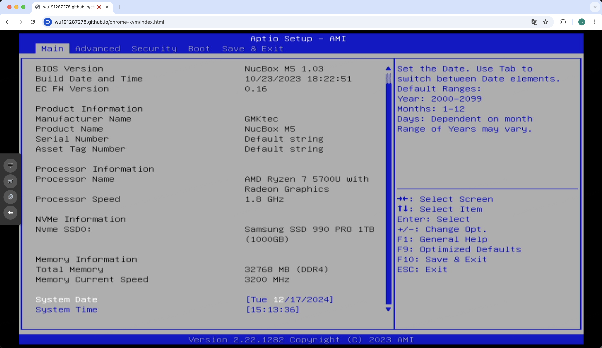
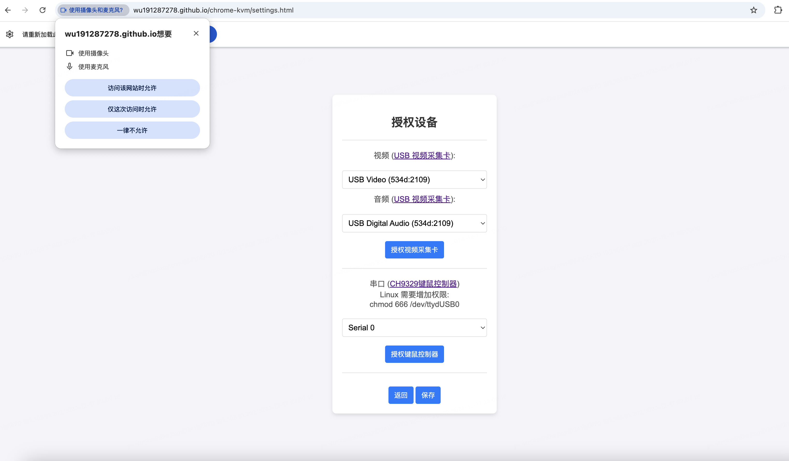
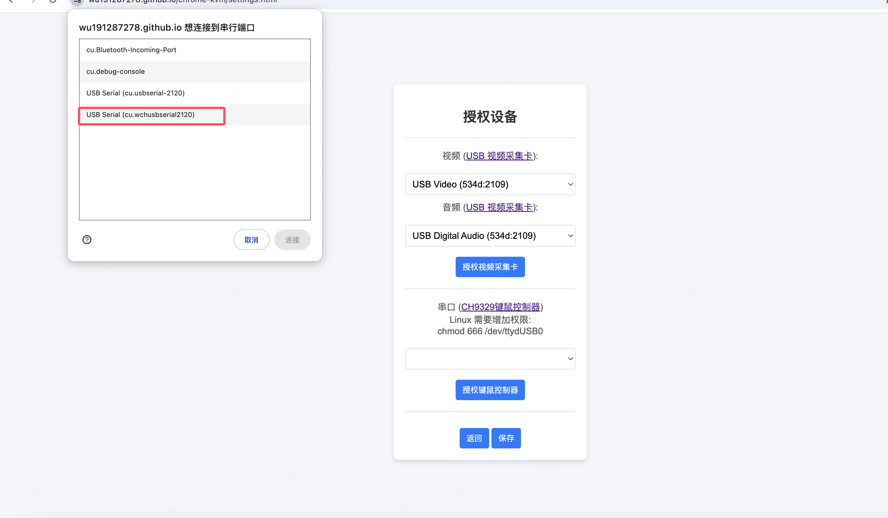
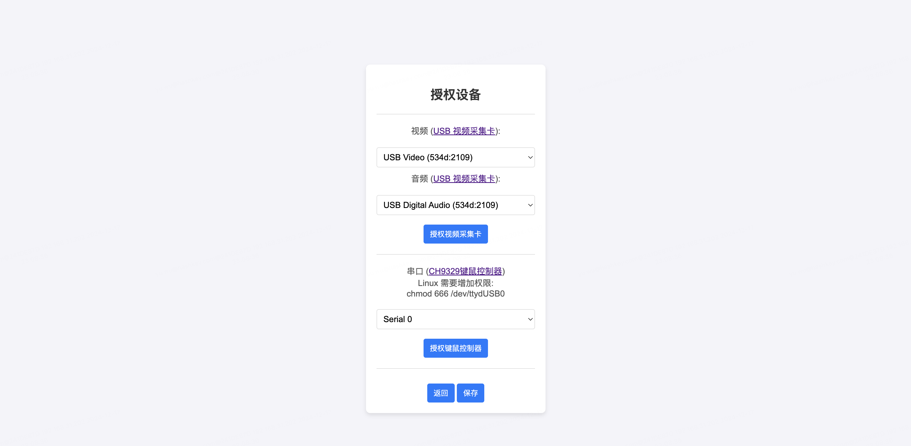
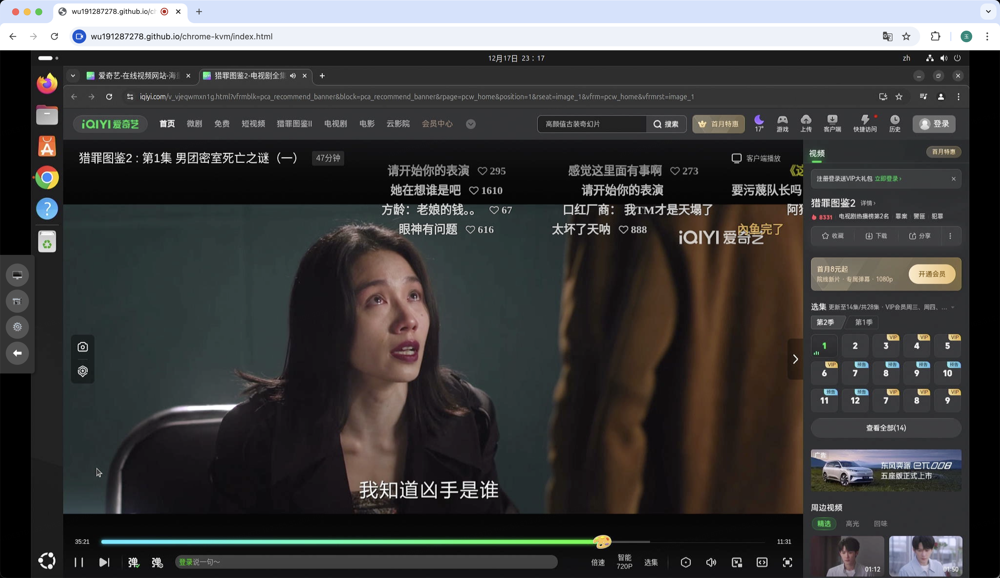

### 介绍

Chrome-KVM 基于 Chrome 浏览器开发的 BIOS 级远程控制项目。仅打开网页即可实现远程管理服务器或工作站，无需在被控机安装软件调整设置，实现无侵入式控制，适用范围广泛。

### 软件功能

表格仅为 Chrome-KVM 与其他基于 PiKVM 的项目的功能对比，无不良导向，如有错漏请联系更正。

|        功能         |   One-KVM    |           PiKVM           |   ArmKVM    | Chrome KVM |
|:-----------------:|:------------:|:-------------------------:|:-----------:|:----------:|
|       系统开源        |      √       |             √             |      √      |     √      |
|    简体中文 WebUI     |      √       |             x             |      √      |     √      |
|       远程视频流       | MJPEG/H.264  |        MJPEG/H.264        | MJPEG/H.264 | H.264/VP8  |
|    H.264 视频编码     |     CPU      |            GPU            |     未知      |    GPU     |
|       远程音频流       |      √       |             √             |      √      |     √      |
|      远程鼠键控制       |  OTG/CH9329  | OTG/CH9329/Pico/Bluetooth |     OTG     |   CH9329   |
|      VNC 控制       |      √       |             √             |      √      |     x      |
|     ATX 电源控制      | GPIO/USB 继电器 |           GPIO            |    GPIO     |     x      |
|     虚拟存储驱动器挂载     |      √       |             √             |      √      |     x      |
| 2.2G 以上 CD-ROM 挂载 |      x       |             x             |      √      |     x      |
|     WOL 远程唤醒      |      √       |             √             |      √      |     x      |
|       网页剪切板       |      √       |             √             |      √      |     x      |
|     OCR 文字识别      |      √       |             √             |      √      |     x      |
|       网页终端        |      √       |             √             |      √      |     x      |
|      网络串口终端       |      x       |             x             |      √      |     x      |
|    HDMI 切换器支持     |      √       |             √             |      √      |     x      |
|       视频录制        |      √       |             x             |      x      |     √      |
|     Docker 部署     |      √       |             x             |      x      |     x      |
|      官方商业化成品      |      x       |             √             |      √      |     x      |
|  任意带有Chrome设备运行   |      x       |             x             |      x      |     √      |
|       无需安装        |      x       |             x             |      x      |     √      |
|       技术支持        |      √       |             √             |      √      |     √      |

### 硬件设备

1. 控制端安装 带有Chrome浏览器
2. USB视频采集卡 [购买网站](http://e.tb.cn/h.TfXLcXooYTXSM4E?tk=XEqJ3xEBB9g)
3. CH9329 远程鼠键控制器 [购买网站](http://e.tb.cn/h.TfXoUbjkCYXwmeW?tk=7Rlp3xEAdqD)
4. 一台被控端PC

### 快速开始

1. 打开该网站：[https://wu191287278.github.io/chrome-kvm/settings.html)
2. 授权使用视频采集卡
   
3. 授权使用键鼠控制器
4. 选择使用的 视频 USB视频采集卡(一般带有" USB 视频"字样)
5. 选择使用的 音频 USB视频采集卡(一般带有 "USB 音频" 字样)
6. 选择使用的 串口设备 (一般带有 "wch" 字样)

7. 点击 保存，然后点击返回，即可控制PC
   
8. 启动系统播放音视频

