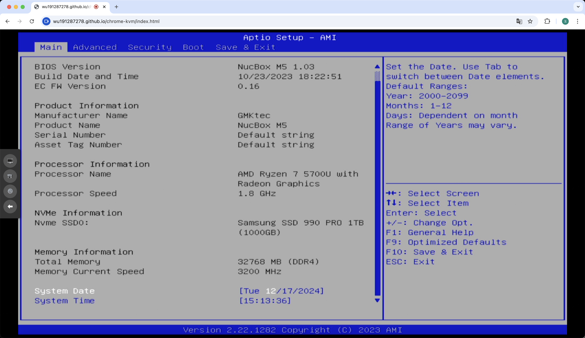
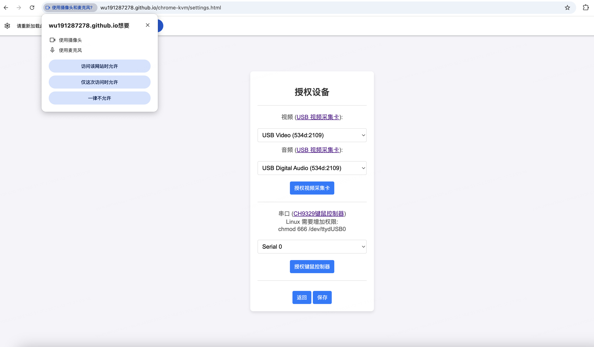
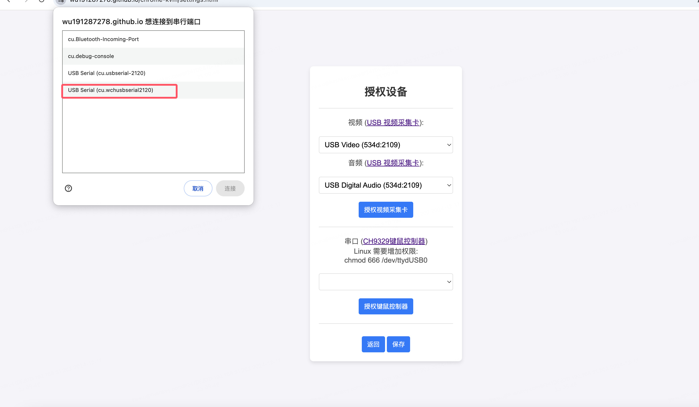
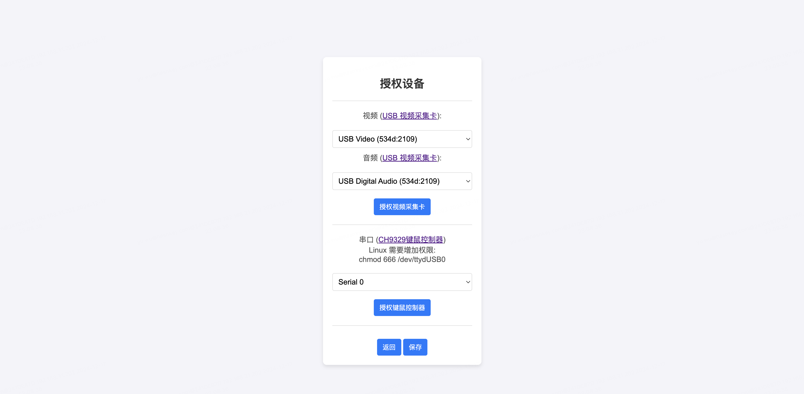

### 介绍

Chrome-KVM 基于 Chrome 浏览器开发的 BIOS 级远程控制项目。仅打开网页即可实现远程管理服务器或工作站，无需在被控机安装软件调整设置，实现无侵入式控制，适用范围广泛。



### 软件功能

表格仅为 Chrome-KVM 与其他基于 PiKVM 的项目的功能对比，无不良导向，如有错漏请联系更正。

|        功能         |   One-KVM    |           PiKVM           |   ArmKVM    | Chrome KVM |
|:-----------------:|:------------:|:-------------------------:|:-----------:|:----------:|
|       系统开源        |      √       |             √             |      √      |     √      |
|    简体中文 WebUI     |      √       |             x             |      √      |     √      |
|       远程视频流       | MJPEG/H.264  |        MJPEG/H.264        | MJPEG/H.264 | H.264/VP8  |
|    H.264 视频编码     |     CPU      |            GPU            |     未知      |    GPU     |
|       远程音频流       |      √       |             √             |      √      |     √      |
|      远程鼠键控制       |  OTG/CH9329  | OTG/CH9329/Pico/Bluetooth |     OTG     |   CH9329   |
|      VNC 控制       |      √       |             √             |      √      |     x      |
|     ATX 电源控制      | GPIO/USB 继电器 |           GPIO            |    GPIO     |     x      |
|     虚拟存储驱动器挂载     |      √       |             √             |      √      |     x      |
| 2.2G 以上 CD-ROM 挂载 |      x       |             x             |      √      |     x      |
|     WOL 远程唤醒      |      √       |             √             |      √      |     x      |
|       网页剪切板       |      √       |             √             |      √      |  √ (仅英文)   |
|     OCR 文字识别      |      √       |             √             |      √      |     x      |
|       网页终端        |      √       |             √             |      √      |     x      |
|      网络串口终端       |      x       |             x             |      √      |     x      |
|    HDMI 切换器支持     |      √       |             √             |      √      |     x      |
|       视频录制        |      √       |             x             |      x      |     √      |
|     Docker 部署     |      √       |             x             |      x      |     x      |
|      官方商业化成品      |      x       |             √             |      √      |     x      |
|  任意带有Chrome设备运行   |      x       |             x             |      x      |     √      |
|       无需安装        |      x       |             x             |      x      |     √      |
|       技术支持        |      √       |             √             |      √      |     √      |

### 硬件设备

1. 控制端安装 带有Chrome浏览器
2. USB视频采集卡 [购买网站](http://e.tb.cn/h.TfXLcXooYTXSM4E?tk=XEqJ3xEBB9g)
3. CH9329 远程鼠键控制器 [购买网站](http://e.tb.cn/h.TfXoUbjkCYXwmeW?tk=7Rlp3xEAdqD)
4. 一台被控端PC

### 快速开始

1. 打开该网站：[设置页](https://flydmonkey.github.io/chrome-kvm/settings.html)
2. 授权使用视频采集卡
   
3. 授权使用键鼠控制器
4. 选择使用的 视频 USB视频采集卡(一般带有" USB 视频"字样)
5. 选择使用的 音频 USB视频采集卡(一般带有 "USB 音频" 字样)
6. 选择使用的 串口设备 (一般带有 "wch" 字样)

7. 点击 保存，然后点击 返回控制页，即可控制PC
   
8. 启动系统播放音视频


### 工具栏

控制页左侧边缘有一条可折叠的工具栏，收起后只在屏幕边缘留一截把手，点它展开。按钮从上到下分成四组：

| 图标     | 作用                                     |
|:-------|:---------------------------------------|
| 摄像机    | 视频状态，鼠标悬停看分辨率和帧率，点击可刷新或重开采集             |
| 键盘加鼠标  | 键鼠状态，鼠标悬停看固件和 USB 枚举情况，点击可刷新或重连         |
| 四角展开   | 全屏，进入后图标变为收拢状，并捕获 Win、Alt+Tab 等系统键        |
| 实心圆    | 录制当前画面，录制中变成红色方块，停止后自动下载 webm 文件        |
| 键盘     | 向被控端发送 Ctrl+Alt+Delete                 |
| 剪贴板    | 把本机剪贴板里的文本逐字符敲到被控端                      |
| 划掉的键盘  | 强制松开所有按键，用于被控端有键卡住时救场                   |
| 齿轮     | 打开设置页                                  |
| 双向箭头   | 刷新页面                                   |
| 尖括号    | 收起或展开工具栏                               |

两个状态图标共用一套配色：灰色未连接，绿色一切正常，黄色能用但有问题，红色已断开。

视频状态里，黄色表示采集卡没有画面输入或还没收到第一帧，红色表示采集中断（通常是采集卡被拔掉）或打开失败，悬停能看到具体原因，点一下会重新打开。

键鼠状态里，黄色的原因可能是 USB 未被被控端枚举、被控端已休眠、或芯片持续无应答已降级成只发不等；红色表示串口已断开。拔掉 CH9329 后插回会自动重连，也可以点图标立即重试。

粘贴功能通过模拟按键实现，因此只支持 US 键盘能直接打出的字符，中文等字符会被跳过并在结束时提示跳过了多少个。粘贴前会读取被控端的 Caps Lock 指示灯，亮着的话先帮你关掉，避免粘出来全是大写。

### 系统快捷键

Win、Alt+Tab、Esc、Ctrl+W 这些键平时会被本机的浏览器和系统先截走，根本到不了被控端。点工具栏的全屏按钮进入全屏后，页面会用 Chrome 的 Keyboard Lock 把它们全部拦下来转发过去——这时按 Win 弹的是被控端的开始菜单，Alt+Tab 切的也是被控端的窗口。

退出全屏要**长按 Esc 两秒**。这是 Chrome 强制保留的逃生口，短按的 Esc 会照常发给被控端，进 BIOS 正需要它。

只有点按钮进的全屏才有这个效果，按 F11 进的全屏不走 Fullscreen API，键盘锁定不生效。悬停全屏按钮可以看到当前是「已捕获」还是「未捕获」。

### 波特率

CH9329 出厂默认 9600bps，在 1080p 下快速移动鼠标时可能略显迟滞。设置页可以把芯片改到 115200bps：选好波特率后点「写入波特率」，**写入后需要把 CH9329 断电重插才生效**（协议规定参数下一次上电启用）。

控制页连接时会自动探测芯片实际使用的波特率，所以即使设置和芯片不一致也能连上，只是那一次连接会多花约一秒。

### 开发

项目是纯静态页面，没有构建步骤，用任意静态服务器打开即可（Web Serial 要求 HTTPS 或 localhost）。

键鼠协议部分有一套不依赖任何外部库的测试，期望字节直接取自 CH9329 串口通信协议 V1.3 的命令样例：

```bash
npm test
```
